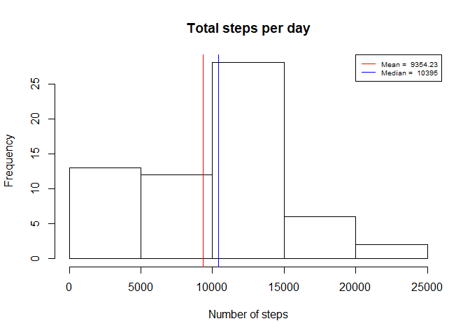
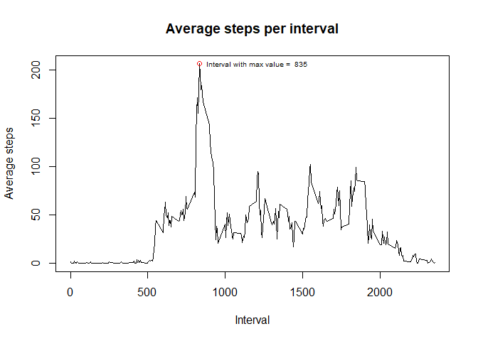
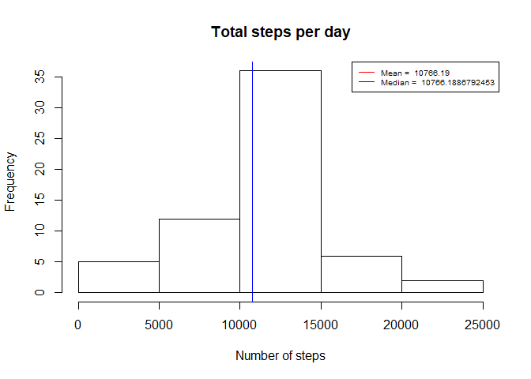

## Loading and preprocessing the data

```r
activity <- read.csv("activity.csv", na.strings = "NA")

activity$date <- as.Date(activity$date, format="%Y-%m-%d")
```


## What is mean total number of steps taken per day?

```r
library(dplyr)
```

```
## 
## Attaching package: 'dplyr'
```

```
## The following objects are masked from 'package:stats':
## 
##     filter, lag
```

```
## The following objects are masked from 'package:base':
## 
##     intersect, setdiff, setequal, union
```

```r
daily <- activity %>% 
  group_by(date) %>% 
  summarize(steps = sum(steps, na.rm = TRUE))

hist(daily$steps, main = "Total steps per day", xlab = "Number of steps")

mean_steps <- mean(daily$steps)
median_steps <- median(daily$steps)

abline(v=mean(daily$steps), col = "red")
abline(v=median(daily$steps), col = "blue")

legend(x = "topright", legend = c(paste("Mean = ", format(mean(daily$steps), digits = 1, nsmall = 2)), paste("Median = ", median(daily$steps))), col = c("red", "blue"), lty = c(1,1), cex = 0.65)
```

<!-- -->


## What is the average daily activity pattern?

```r
interval_steps <- activity %>% 
  group_by(interval) %>% 
  summarize(steps = mean(steps, na.rm = TRUE))

plot(interval_steps$interval, interval_steps$steps, type = "l", main = "Average steps per interval", xlab = "Interval", ylab = "Average steps")

max_pos <- which.max(interval_steps$steps)

points(interval_steps$interval[max_pos], interval_steps$steps[max_pos], type = "p", col = "red")

text(interval_steps$interval[max_pos], interval_steps$steps[max_pos], cex=0.65, pos=4, paste("Interval with max value = ", interval_steps$interval[max_pos]))
```

<!-- -->


## Imputing missing values
There are a total of 2304 null values (NAs) in the dataset, which represents a 13.1147541% of all observations.

Let's fill in the NA values with the average value of steps reported in the corresponding interval.

Plotting again the histogram of steps per day...


```r
s <- merge(x = activity, y = interval_steps, by.x = "interval", by.y = "interval") %>%
  mutate(steps = ifelse(is.na(steps.x), steps.y, steps.x)) %>%
  select(steps, date, interval)

daily <- s %>% 
  group_by(date) %>% 
  summarize(steps = sum(steps, na.rm = TRUE))

hist(daily$steps, main = "Total steps per day", xlab = "Number of steps")

mean_steps_noNAs <- mean(daily$steps)
median_steps_noNAs <- median(daily$steps)

abline(v=mean(daily$steps), col = "red")
abline(v=median(daily$steps), col = "blue")

legend(x = "topright", legend = c(paste("Mean = ", format(mean(daily$steps), digits = 1, nsmall = 2)), paste("Median = ", median(daily$steps))), col = c("red", "blue"), lty = c(1,1), cex = 0.65)
```

<!-- -->

Comparing the mean and median values of the series with and without NA values, it can be seen a difference between mean and median values and that mean and median values match for the series without NA values.


```r
data.frame(series = c("With NAs", "Filled NAs"), 
                  mean = c(mean_steps, mean_steps_noNAs),
                  median = c(median_steps, median_steps_noNAs)) 
```

```
##       series     mean   median
## 1   With NAs  9354.23 10395.00
## 2 Filled NAs 10766.19 10766.19
```


## Are there differences in activity patterns between weekdays and weekends?


```r
library(lattice)
workingdays <- c("Monday", "Tuesday", "Wednesday", "Thursday", "Friday")
s <- s %>% mutate(weekday = ifelse(weekdays(date) %in% workingdays, "weekday", "weekend"))

plt <- s %>% 
  group_by(interval, weekday) %>% 
  summarize(steps = mean(steps))

xyplot(data = plt, steps~interval|weekday, type = "l", layout = c(1,2))
```

<!-- -->

